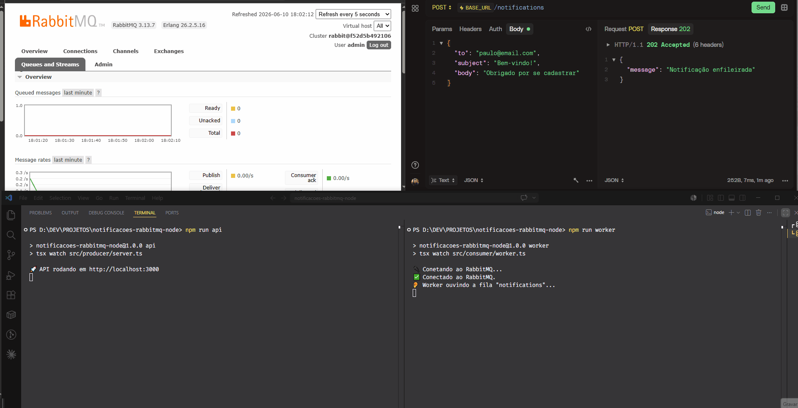

# 📬 API de Notificações com RabbitMQ (Node.js + TypeScript)

Projeto de estudo demonstrando **mensageria assíncrona** com RabbitMQ.
Uma API REST publica notificações em uma fila, e um worker as processa em
background — desacoplando o recebimento do processamento.

> 💡 Implementei o mesmo projeto também com **NestJS** para comparar abordagens:
> https://github.com/paulomvrech/notifications-rabbitmq-nest

## 🏗️ Arquitetura

```
Cliente → API (Express) → RabbitMQ → Worker → "envia e-mail"
```

A API só **publica** a notificação na fila e responde na hora (`202 Accepted`).
Quem realmente processa é o worker, num processo separado. Producer e consumer
não precisam estar online ao mesmo tempo — é exatamente isso que o GIF abaixo
demonstra.

## 🎬 Demonstração



O que está acontecendo no GIF, passo a passo:

1. **Worker ligado:** ao disparar uma requisição, a notificação é publicada e
   processada quase instantaneamente.
2. **Worker desligado:** mesmo sem ninguém consumindo, a API continua aceitando
   requisições e respondendo na hora. As mensagens ficam **acumuladas e seguras
   na fila** `notifications` — dá pra ver o contador subindo no painel do RabbitMQ.
3. **Worker religado:** ele imediatamente "devora" todas as mensagens represadas,
   uma a uma, e o contador da fila volta a zero.

Esse é o coração da mensageria assíncrona: **o producer e o consumer são
totalmente desacoplados**. Se o worker cair, nada se perde — o RabbitMQ guarda
as mensagens até alguém processá-las.

## 🛠️ Tecnologias
- Node.js + TypeScript
- Express
- RabbitMQ (via `amqplib`)
- Docker / Docker Compose

## 🚀 Como rodar

```bash
# 1. Suba o RabbitMQ
docker compose up -d

# 2. Instale as dependências
npm install

# 3. Em terminais separados:
npm run api      # sobe a API REST (producer)
npm run worker   # sobe o worker consumidor
```

## 🧪 Testando

```bash
curl -X POST http://localhost:3000/notifications \
  -H "Content-Type: application/json" \
  -d '{"to":"teste@email.com","subject":"Olá","body":"Mensagem de teste"}'
```

Painel de administração do RabbitMQ: http://localhost:15672 (admin / admin123)

> Dica: para reproduzir o experimento do GIF, deixe o painel aberto na aba
> **Queues**, desligue o worker (`Ctrl+C`), dispare alguns `curl` e veja as
> mensagens se acumularem antes de religar o worker.

## 📚 Conceitos demonstrados
- Producer/Consumer desacoplados
- Filas duráveis e mensagens persistentes (sobrevivem a reinício do broker)
- Acknowledgements manuais (`ack`/`nack`)
- Distribuição de carga com `prefetch`
- Desligamento gracioso (graceful shutdown)
